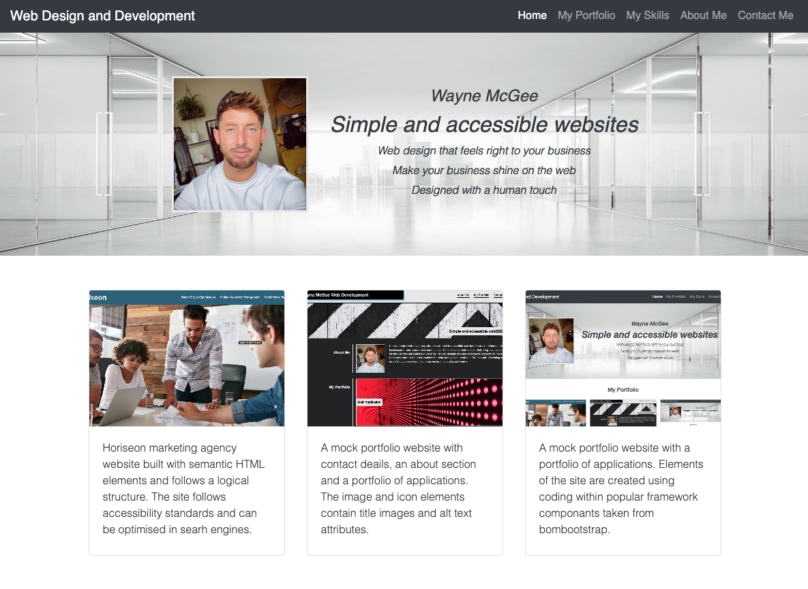

# Bootstrap-Portfolio

week 3 challenge - bootstrap portfolio

## Description 

A mock portfolio website that is powered by Bootstrap and uses Bootstrap CSS framework. 
The website follows accessibility standards, so that the website can be optimised in searh engines. 
The loaded page presents the portfolio with a navigation bar, navigation menu at the top, a hero section using a jumbotron featuring a profile picture with name and additional information. The work section displays projects within a grid using Bootstrap cards and information about each project. Additional sections include contact box, skills, an about me section and a footer with clickable links.
The website has semantic HTML elements, and follows a logical structure independent of styling and positioning. The image and icon elements contain titles, alt text attributes and heading attributes fall in sequential order. The elements containt concise, descriptive titles. 

## Screenshot

## Links

Solution URL - https://github.com/wmcgee1982/Bootstrap-Portfolio.git
Live URL - https://wmcgee1982.github.io/Bootstrap-Portfolio/

## Installation

N/A

## Usage 

No passwords needed. One page website. HTML and CSS elements that follows logical structure. Display uses flex and grids. 
Nav and contacts use linkable elements as too does the images within the portfolio. Nav links to parts within the same page. All other links are external. 

## Credits

Wayne McGee

## License

MIT license